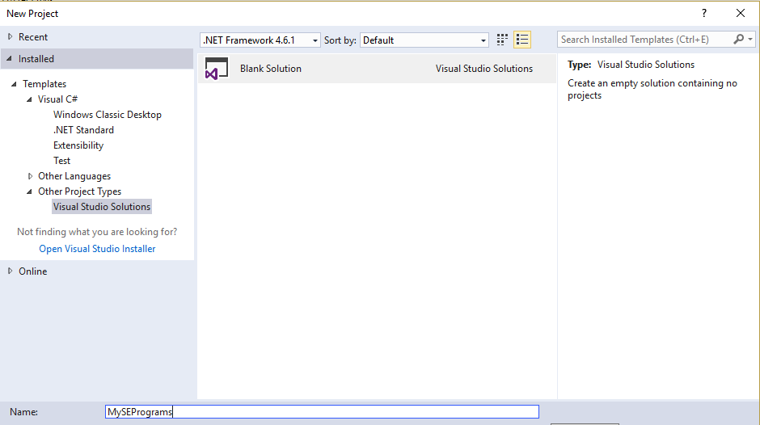
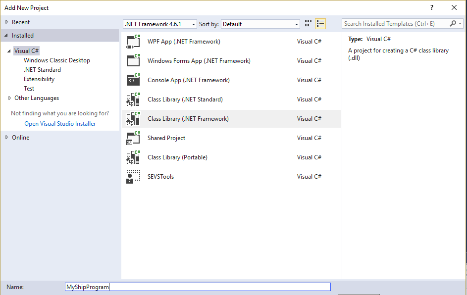
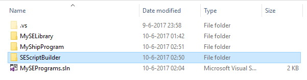
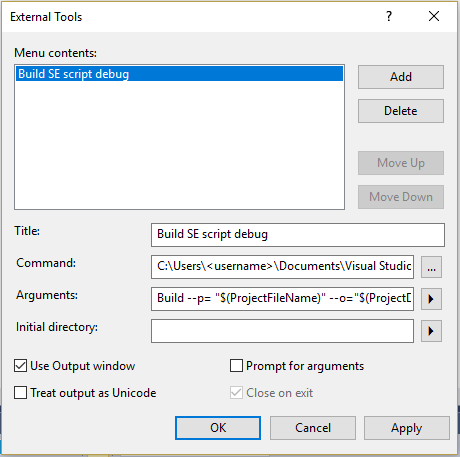
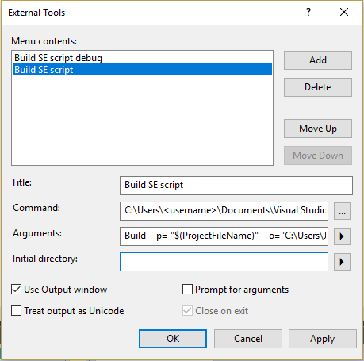
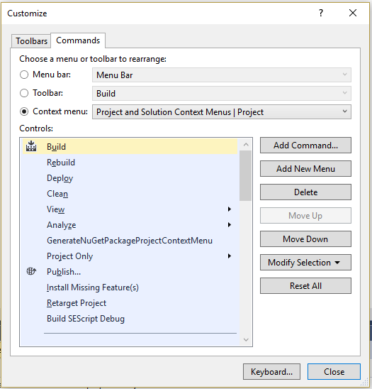
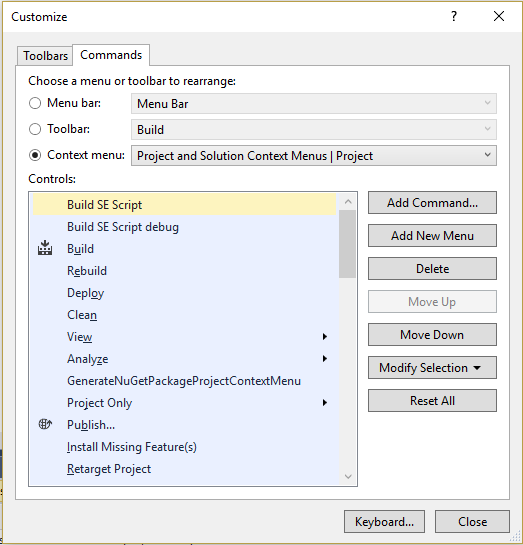
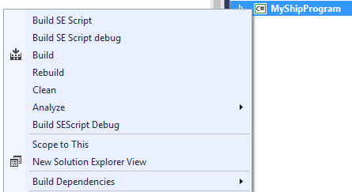
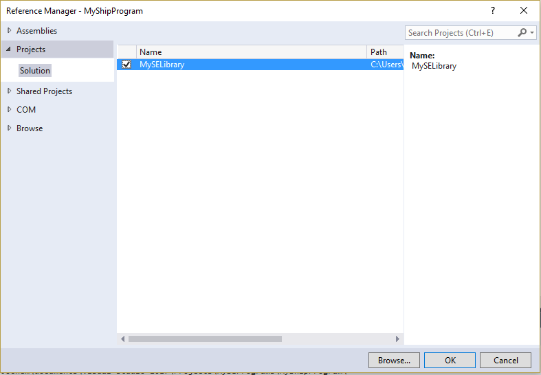
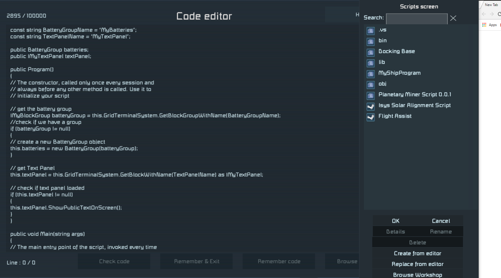

# How to set the tool up with Visual Studio
This guide will show how to use the tool in your visual studio solutions by example. 
Make sure you have installed Visual Studio and can create projects for Visual Studio. 
A good guide can be found here: https://forum.keenswh.com/threads/setup-visual-studio-for-se-programming.7385455/
Find the post from Inflex (with all the screenshots). If you're installing VS 2017 check the bottom part of the post.
Also note which references need to be added to a project. 

## Setting up your solution
A solution can contain multiple projects, which can use each other.
 We will first create an empty solution by selecting __File > New > Project__. 
In the 'New Project' window select the Blank Solution:

Here I've called the solution MySEPrograms.
Now we are going to create two projects: one 'main' project and one library project.
Right click on the solution in the 'Solution Explorer' window and choose __Add > New Project..__ Make sure you select 
"Class Library (.Net Framework)" as shown below

Name the project MyShipProgram for example. Now create another project and call it MySELibrary.
Now make sure you add all the references as stated in the link above ([this one](https://forum.keenswh.com/threads/setup-visual-studio-for-se-programming.7385455/)).
You should now have two projects with the references to the games .dll files. Next we are going to set up the tool.

## Setting up the tool
Download SEScriptBuilder.exe here. In this example we will download it to our solution folder:


### Creating external tools
Now we are going to add the .exe file as an external tool, so we can run it on with Visual Studio.
Goto __Tools > External tools...__ this will open a new window. Next click the __Add__ button.
Select the added tool and name the title "Build SE script debug". 
For the command field, click the browse button and select the SEScriptBuilde.exe file you've downloaded before.
Now we need to set up the parameters. Enter the following parameters:
```
Build -p="$(ProjectDir)$(ProjectFileName)" -o="$(ProjectDir)"
```
We call the build command of the tool. To set the path or the project file (--p) and the output path (--o) we use variables from Visual Studio.
You can see the available variables if you click on the button with the arrow. 
The ones we use here gives us the project file name ($(ProjectFileName)) and ($(ProjectDir)).
 Next make sure to check the __Use Output Window__ box:


Now don't close the window but press the __Apply__ button and add another tool.
Call this one "Build SE Script" and again select the SEScriptBuilder.exe file in the command box.
 We are going to use this tool to deploy scripts to the script folder of Space Engineers, so we can load them from the workshop(?) menu ingame.
This folder can be found in you AppData folder. This is hidden by default and resides in your user folder.
[Click here](http://www.windows10themes.net/guides/how-to-view-the-appdata-folder-in-windows-10/) for more information.
The full path is something like:
```
C:\Users\<username>\AppData\Roaming\SpaceEngineers\IngameScripts\local
```
Now we are going to use this folder as output and add a "Production" flag to the parameters:
```
Build --p= "$(ProjectDir)$(ProjectFileName)" --o="C:\Users\<username>\AppData\Roaming\SpaceEngineers\IngameScripts\local" --prod
```
Replace the output path with your own, make sure its between quotes. Note the --prod to enable production mode.
Again check the __User Output Window__ box and press apply. You should now have two tools:

You can now close the window.

### Add tools to right click menu
Now we have the tools we need a way to run them.
To achieve this we are going to add two buttons on the right click menu of projects.
Go to __Tools > Customize...__ and select the __Commands__ tab. 
Now select the Context Menu radio button and from the dropdown select "Project and Solution Context Menus | Project".


Now press the __Add Command...__ button and select __Tools__ in the categories menu. 
Then select __External Command 1__ on the right and click ok.


Now also add __External Command 2__. 
(Note that if you already had custom commands these numbers may be different).
Now still in the customize window, rename the commands by selecting it and clicking
__Modify Selection__. Rename "External Command 1" to "Build SE script debug" and the second command to "Build SE Script".

Close the window and Right Click on a project in the Solution Explorer. You should see two new buttons.


Now that we have set up the tool, we can start to add some code!

## Creating a library class
First we are going to create the class we are going to use in our main program.
We are going to make a BatteryGroup class, which we can use to get the total stored power.
Create a new class file in the Library project (MySELibrary in this example) by pressing right mouse button on the project and choosing __Add > Class...__
Name the class "BatteryGroup.cs" and add the following code:
```
using System;
using System.Linq;
using System.Text;
using System.Collections;
using System.Collections.Generic;

using VRageMath;
using VRage.Game;
using VRage.Collections;
using Sandbox.ModAPI.Ingame;
using VRage.Game.Components;
using VRage.Game.ModAPI.Ingame;
using Sandbox.ModAPI.Interfaces;
using Sandbox.Game.EntityComponents;
using SpaceEngineers.Game.ModAPI.Ingame;
using VRage.Game.ObjectBuilders.Definitions;


namespace MySELibrary
{
	public class BatteryGroup
	{
		private List<IMyBatteryBlock> batteries;

		public BatteryGroup(IMyBlockGroup batts)
		{
			// create a new list for batteries
			this.batteries = new List<IMyBatteryBlock>();
			// fill list with batteries
			batts.GetBlocksOfType<IMyBatteryBlock>(this.batteries);
		}

		public float GetStoredPower()
		{
			float totalStoredPower = 0;
			// check if we have batteries
			if (batteries != null && batteries.Count() > 0)
			{
				// loop through batteries
				for (int i = 0; i < batteries.Count(); i++)
				{
					// get the battery block
					IMyBatteryBlock battery = batteries.ElementAt(i);
					// add stored power to total stored power
					totalStoredPower += battery.CurrentStoredPower;
				}
			}
			// return the total stored power
			return totalStoredPower;
		}

		public float GetMaxStoredPower()
		{
			float totalMaxStoredPower = 0;
			// check if we have batteries
			if (batteries != null && batteries.Count() > 0)
			{
				// loop through batteries
				for (int i = 0; i < batteries.Count(); i++)
				{
					// get the battery block
					IMyBatteryBlock battery = batteries.ElementAt(i);
					// add stored power to total stored power
					totalMaxStoredPower += battery.MaxStoredPower;
				}
			}
			return totalMaxStoredPower;
		}
	}
}
```
Note that if your project name is different change the namespace to your project name. 
This class takes a IMyBlockGroup with batteries, when constructed and allows you to get 
the total stored power and the total max stored power of the batteries int the group.

We are going to use this class in our main project: MyShipProgram. Before we can do that,
we need to add the library project as a reference to the main project. This can be done by
right clicking the References node from the main project in the solution explorer.
Click __Add reference...__ and expand __Projects__ on the left. Check the box of the library project:
 

Click Ok and create a new class file in the main project. Name it MyShipProgram.cs and add the following code:
```
using System;
using System.Linq;
using System.Text;
using System.Collections;
using System.Collections.Generic;

using VRageMath;
using VRage.Game;
using VRage.Collections;
using Sandbox.ModAPI.Ingame;
using VRage.Game.Components;
using VRage.Game.ModAPI.Ingame;
using Sandbox.ModAPI.Interfaces;
using Sandbox.Game.EntityComponents;
using SpaceEngineers.Game.ModAPI.Ingame;
using VRage.Game.ObjectBuilders.Definitions;

using MySELibrary;

namespace MyShipProgram
{
    public class MyShipProgram : MyGridProgram
    {
		const string BatteryGroupName = "MyBatteries";
		const string TextPanelName = "MyTextPanel";

		public BatteryGroup batteries;
		public IMyTextPanel textPanel;

		public MyShipProgram()
		{
			// The constructor, called only once every session and
			// always before any other method is called. Use it to
			// initialize your script
			
			// get the battery group
			IMyBlockGroup batteryGroup = this.GridTerminalSystem.GetBlockGroupWithName(BatteryGroupName);
			//check if we have a group
			if (batteryGroup != null)
			{
				// create a new BatteryGroup object
				this.batteries = new BatteryGroup(batteryGroup);
			}

			// get Text Panel
			this.textPanel = this.GridTerminalSystem.GetBlockWithName(TextPanelName) as IMyTextPanel;

			// check if text panel loaded
			if (this.textPanel != null)
			{
				this.textPanel.ShowPublicTextOnScreen();
			}
		}

		public void Main(string args)
		{
			// The main entry point of the script, invoked every time
			// one of the programmable block's Run actions are invoked.
			// The method itself is required, but the argument above
			// can be removed if not needed.

			// check if we have our textpanel and batteries
			if (this.textPanel != null && this.batteries != null)
			{
				// create a message with our BatteryGroup Object
				string msg = "Total battery power: " + this.batteries.GetStoredPower().ToString() + "/" + this.batteries.GetMaxStoredPower().ToString();

				// write message on textpanel
				this.textPanel.WritePublicText(msg);
			}
		}
	}
}
```
This class extends MyGridProgram. The tool will recognize this and use this file/class as the main script file.
The class could be called anything except Program. The section about running the tool in debug mode explains why.
From here on out it will check which code is needed by this file. It looks at the constructor, the main function and the save function (not shown here).
As you can see we create a new BatteryGroup:
```
this.batteries = new BatteryGroup(batteryGroup);
```
And use it later on:
```
string msg = "Total battery power: " + this.batteries.GetStoredPower().ToString() + "/" + this.batteries.GetMaxStoredPower().ToString();
```
The mainprogram simply writes this message on the TextPanel.
Also note that the class uses our library:
```
using MySELibrary;
```
IF you changed the namespace in the BatteryGroup file, you need to change this to the same name. Visual Studio can help you with this.

### Running the tool

#### Debug mode
Now that we have our code we will run the tool to build a script file, which can be used
on a program block. Right click on your main project and click __Build SE Script debug__.
The output of visual studio will look something like this, if the tool runs succesfully:
```
Executing Build (Build a space engineers script):
    OutputPath : C:\Users\<username>\documents\visual studio 2017\Projects\MySEPrograms\MyShipProgram\
    ProductionMode : False
    ProjectPath : C:\Users\<username>\documents\visual studio 2017\Projects\MySEPrograms\MyShipProgram\MyShipProgram.csproj

Starting build of project: C:\Users\<username>\documents\visual studio 2017\Projects\MySEPrograms\MyShipProgram\MyShipProgram.csproj
Project loaded...
Analyzing source code
Found program file: C:\Users\<username>\documents\visual studio 2017\Projects\MySEPrograms\MyShipProgram\MyShipProgram.cs
Renaming main program class
Merging dependencies
Injecting dependencies
Finished building: C:\Users\<username>\documents\visual studio 2017\Projects\MySEPrograms\MyShipProgram\Script.cs
```
We see that the tool has written a Script.cs file, but it doesn't show up in our project. 
If we look in the file explorer we can see that Script.cs is indeed added to the project.
To make it visible in the project right click on it and choose __Add > Existing Item...__.
Select Script.cs and click ok. You should now see the file in your Solution Explorer, open it.
Note that Visual Studio analyses the code and would show any errors if there would be.
It should contain the following code:
```
#if DEBUG
using System;
using System.Linq;
using System.Text;
using System.Collections;
using System.Collections.Generic;

using VRageMath;
using VRage.Game;
using VRage.Collections;
using Sandbox.ModAPI.Ingame;
using VRage.Game.Components;
using VRage.Game.ModAPI.Ingame;
using Sandbox.ModAPI.Interfaces;
using Sandbox.Game.EntityComponents;
using SpaceEngineers.Game.ModAPI.Ingame;
using VRage.Game.ObjectBuilders.Definitions;
using MySELibrary;

namespace MyShipProgram
{
    public class Program: MyGridProgram
    {
#endif
		const string BatteryGroupName = "MyBatteries";
		const string TextPanelName = "MyTextPanel";

		public BatteryGroup batteries;
		public IMyTextPanel textPanel;

		public Program()
		{
			// The constructor, called only once every session and
			// always before any other method is called. Use it to
			// initialize your script
			
			// get the battery group
			IMyBlockGroup batteryGroup = this.GridTerminalSystem.GetBlockGroupWithName(BatteryGroupName);
			//check if we have a group
			if (batteryGroup != null)
			{
				// create a new BatteryGroup object
				this.batteries = new BatteryGroup(batteryGroup);
			}

			// get Text Panel
			this.textPanel = this.GridTerminalSystem.GetBlockWithName(TextPanelName) as IMyTextPanel;

			// check if text panel loaded
			if (this.textPanel != null)
			{
				this.textPanel.ShowPublicTextOnScreen();
			}
		}

		public void Main(string args)
		{
			// The main entry point of the script, invoked every time
			// one of the programmable block's Run actions are invoked.
			// The method itself is required, but the argument above
			// can be removed if not needed.

			// check if we have our textpanel and batteries
			if (this.textPanel != null && this.batteries != null)
			{
				// create a message with our BatteryGroup Object
				string msg = "Total battery power: " + this.batteries.GetStoredPower().ToString() + "/" + this.batteries.GetMaxStoredPower().ToString();

				// write message on textpanel
				this.textPanel.WritePublicText(msg);
			}
		}
	public class BatteryGroup
	{
		private List<IMyBatteryBlock> batteries;

		public BatteryGroup(IMyBlockGroup batts)
		{
			// create a new list for batteries
			this.batteries = new List<IMyBatteryBlock>();
			// fill list with batteries
			batts.GetBlocksOfType<IMyBatteryBlock>(this.batteries);
		}

		public float GetStoredPower()
		{
			float totalStoredPower = 0;
			// check if we have batteries
			if (batteries != null && batteries.Count() > 0)
			{
				// loop through batteries
				for (int i = 0; i < batteries.Count(); i++)
				{
					// get the battery block
					IMyBatteryBlock battery = batteries.ElementAt(i);
					// add stored power to total stored power
					totalStoredPower += battery.CurrentStoredPower;
				}
			}
			// return the total stored power
			return totalStoredPower;
		}

		public float GetMaxStoredPower()
		{
			float totalMaxStoredPower = 0;
			// check if we have batteries
			if (batteries != null && batteries.Count() > 0)
			{
				// loop through batteries
				for (int i = 0; i < batteries.Count(); i++)
				{
					// get the battery block
					IMyBatteryBlock battery = batteries.ElementAt(i);
					// add stored power to total stored power
					totalMaxStoredPower += battery.MaxStoredPower;
				}
			}
			return totalMaxStoredPower;
		}
	}
#if DEBUG
}
}

#endif
```
It following has happened:
The class name and constructor are renamed to "Program". This way it can run on a Programmable block,
which need a constructor with the name "Program". If our original program file (MyShipProgram) would also
contain a class named "Program", Visual Studio would start showing errors because the project contains
two definitions of the class Program, hence class in the original file shoudl be called different.
We can also see that the class BatteryGroup is injected in the Program Class. The tool will only
import functions, classes and properties it needs. Currently the tool won't handle importing classes with 
the same name, although they are in different namespaces.

Last thing to note are the added #if DEBUG and #endif. Code between these tags will be ignored
by the programmable block, but Visual Studio needs it if you want to use its code checking. 
(TODO: does project need to define DEBUG variable?) 

Now you can start up Space Engineers to test the code. Start a new world in creative and
create a base with some batteries, a textpanel and a programable block.
Group the batteries and name the group "MyBatteries". Rename the textpanel to "MyTextPanel".

 

Now copy the whole code from the Script.cs file to the programmable block. Click "check code"
and make sure that it has no errors. Now run the programmable block and check the TextPanel.
It should have a updated text on it. (It will probably show low numbers, because they are in MW).

#### Production Mode
Now lets run the tool in production mode: right click on the main project and click "Build SE Script".
If your remember we set the output path to the script folder of Space Engineers. If you check that folder
in your file explorer (C:\Users\<username>\AppData\Roaming\SpaceEngineers\IngameScripts\local), you should
see a new folder called MyShipProgram, which contains a Script file. Now go to your Programmable 
BLock in your control panel and edit the script. Now click "Browse Workshop". The list should show
a script called MyShipProgram, select it and click ok. Try to run the script and assure there are no errors.


The created script differs from the one created in debug mode. It only contains the inner body of the main program class.


